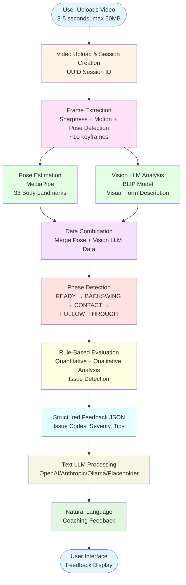
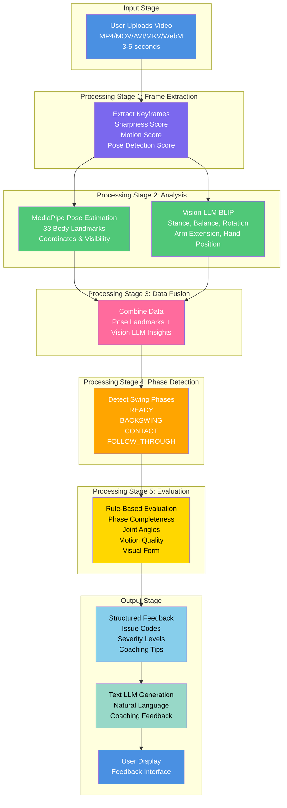

# Pickleball Training Chatbot System - Pipeline Diagram

## Mermaid Diagram

## Detailed Pipeline Flow

## How to View These Diagrams

1. **GitHub/GitLab**: Mermaid diagrams render automatically in markdown files
2. **VS Code**: Install "Markdown Preview Mermaid Support" extension
3. **Online**: Copy the mermaid code to https://mermaid.live/
4. **Documentation Tools**: Many documentation platforms support Mermaid natively

