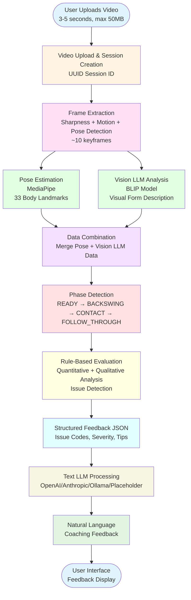

# Pickleball Training Chatbot System Report

## 1. System Pipeline Overview

The pickleball training chatbot system follows a comprehensive pipeline to analyze player technique from uploaded videos and provide personalized coaching feedback. The complete pipeline consists of the following stages:

### 1.0 Pipeline Diagram

The following diagram illustrates the complete pipeline flow:



**Note**: A detailed SVG diagram is also available in `pipeline_diagram.svg` for high-quality printing and presentations.

### 1.1 Video Upload and Processing
- **Input**: User uploads a 3-5 second video file (MP4, MOV, AVI, MKV, or WebM format, max 50MB)
- **Session Management**: Each video is assigned a unique session ID (UUID) for tracking
- **Storage**: Video is saved in `back_end/data/video/{session_id}/`

### 1.2 Frame Extraction
- **Method**: Extracts keyframes based on multiple criteria:
  - **Sharpness Score**: Uses Laplacian variance to identify clear, in-focus frames
  - **Motion Score**: Detects frames with significant movement changes
  - **Pose Detection Score**: Prioritizes frames where the player's pose is clearly visible
- **Output**: Typically extracts 10 keyframes saved in `back_end/data/frames/{session_id}/`
- **Algorithm**: Combines sharpness, motion, and pose visibility scores to select the most informative frames

### 1.3 Pose Estimation
- **Technology**: MediaPipe Pose Estimation
- **Process**: Extracts 33 body landmarks from each keyframe, including:
  - Shoulders, elbows, wrists (left and right)
  - Hips, knees, ankles
  - Head, nose, eyes
- **Output**: JSON files containing landmark coordinates (x, y, z) and visibility scores
- **Storage**: Saved in `back_end/data/pose/{session_id}/`

### 1.4 Vision LLM Analysis (Optional Enhancement)
- **Model**: Hugging Face BLIP (Bootstrapping Language-Image Pre-training) - `Salesforce/blip-image-captioning-large`
- **Purpose**: Provides descriptive analysis of visual elements that MediaPipe cannot capture:
  - Stance assessment (open, closed, square)
  - Balance evaluation (stable, unstable)
  - Arm extension quality (full, partial, bent)
  - Body rotation (good, minimal, insufficient)
  - Hand position (for backhand: together, separated)
  - Arm structure (extended, collapsed)
- **Process**: 
  - Each keyframe is analyzed with skill-specific prompts
  - Generates descriptive text about the player's form
  - Text is parsed into structured JSON format
- **Output**: Vision LLM analyses saved in `back_end/data/vision_llm/{session_id}_analyses.json`

### 1.5 Data Combination
- **Process**: Merges MediaPipe pose landmarks with Vision LLM insights
- **Result**: Creates unified data structure containing both quantitative (pose coordinates) and qualitative (visual descriptions) information
- **Storage**: Combined data saved in `back_end/data/combined/{session_id}_combined.json`

### 1.6 Phase Detection
- **Purpose**: Segments the swing into distinct phases for detailed analysis
- **Phases Detected**:
  - **READY**: Initial preparation position
  - **BACKSWING**: Backward motion preparing for swing
  - **CONTACT**: Peak/moment of contact (or equivalent in shadow swing)
  - **FOLLOW_THROUGH**: Completion of swing motion
- **Method**: Uses pose landmarks to calculate:
  - Wrist velocity (horizontal movement)
  - Elbow angles
  - Shoulder rotation
  - Hand positions (for backhand)
- **Output**: Phase labels for each frame saved in `back_end/data/phase/{session_id}_phases.json`

### 1.7 Rule-Based Issue Evaluation
- **Process**: Analyzes detected phases against predefined technical rules
- **Input**: Phase data + combined pose/Vision LLM data
- **Method**: Evaluates multiple criteria:
  - Phase completeness (all phases present?)
  - Joint angles (elbow extension, arm structure)
  - Motion quality (acceleration, velocity)
  - Visual form (stance, balance, rotation)
- **Output**: Structured feedback with issue codes, descriptions, severity levels, and coaching tips
- **Storage**: Feedback saved in `back_end/data/feedback/{session_id}_feedback.json`

### 1.8 LLM-Based Feedback Generation
- **Purpose**: Converts structured technical feedback into natural, encouraging coaching language
- **Input**: 
  - Structured feedback JSON (issues, tips, severity)
  - Optional Vision LLM summary (visual observations)
- **Process**: 
  - Builds prompt with system instructions and user feedback data
  - Sends to text LLM API
  - Generates personalized coaching response
- **Output**: Natural language feedback displayed to user

### 1.9 User Interface
- **Frontend**: Simple HTML/JavaScript interface
- **Features**:
  - Skill selection (Drive Forehand or Drive Two-Handed Backhand)
  - Video upload with drag-and-drop
  - Progress tracking (3 steps: Upload → Analyze → Feedback)
  - Real-time status updates
  - Feedback display section

---

## 2. Models and LLM Technologies Used

### 2.1 Vision-Language Model (VLM)

**Model**: Hugging Face BLIP (Bootstrapping Language-Image Pre-training)
- **Specific Model**: `Salesforce/blip-image-captioning-large`
- **Type**: Vision-Language Model for image captioning and description
- **Purpose**: Analyzes keyframes to provide descriptive feedback about visual form elements
- **Input**: Image frames (keyframes extracted from video)
- **Output**: Descriptive text about stance, balance, arm extension, body rotation, etc.
- **Device**: Auto-detects CUDA (GPU) if available, otherwise uses CPU
- **Size**: ~1.4GB (downloaded on first use)
- **Loading**: Pre-loaded at server startup in background thread to avoid blocking

**Why BLIP?**
- Open-source and free (no billing required)
- Good balance between accuracy and resource requirements
- Effective at generating descriptive text from images
- Can be run locally without API dependencies

### 2.2 Text LLM (Coaching Feedback Generation)

The system supports multiple LLM providers for generating natural language coaching feedback:

#### Option 1: OpenAI
- **Models**: GPT-4, GPT-3.5-turbo, or other OpenAI models
- **Configuration**: Set `LLM_PROVIDER=openai` and `OPENAI_API_KEY` environment variable
- **Max Tokens**: 1000 (allows detailed feedback)
- **Temperature**: 0.7 (balanced creativity/consistency)

#### Option 2: Anthropic (Claude)
- **Models**: Claude-3, Claude-2, or other Anthropic models
- **Configuration**: Set `LLM_PROVIDER=anthropic` and `ANTHROPIC_API_KEY` environment variable
- **Max Tokens**: 1000

#### Option 3: Ollama (Local Models)
- **Models**: Any Ollama-compatible model running locally
- **Configuration**: Set `LLM_PROVIDER=ollama` and `OLLAMA_URL` (default: http://localhost:11434)
- **Advantage**: Runs completely locally, no API costs

#### Option 4: Placeholder (Default)
- **Behavior**: If no LLM provider is configured, system uses intelligent placeholder
- **Functionality**: 
  - Extracts all issues from structured feedback
  - Formats them clearly with issue descriptions and tips
  - Provides numbered list of problems and solutions
  - Includes severity indicators
- **Advantage**: System works without any LLM API setup or costs

**Prompt Engineering**:
- System prompts are skill-specific (stored in `back_end/llm/prompts/`)
- Prompts instruct LLM to:
  - Address ALL issues (not just top 2)
  - Clearly state each issue with corresponding advice
  - Use friendly, encouraging coaching tone
  - Avoid technical jargon (angles, numbers, codes)
  - Focus on body movement and swing feeling
  - Be thorough but conversational (200-400 words)

---

## 3. Phase Definitions

The system segments pickleball swings into four distinct phases. Phase detection algorithms differ slightly between forehand and backhand skills.

### 3.1 Drive Forehand Phases

#### READY Phase
- **Definition**: Initial preparation position before the swing begins
- **Detection Criteria**: 
  - Wrist velocity is minimal (absolute value < 0.002)
  - Player is in starting/ready position
- **Key Characteristics**: 
  - Stable stance
  - Arm in neutral position
  - Body prepared for movement

#### BACKSWING Phase
- **Definition**: Backward motion preparing for the forward swing
- **Detection Criteria**: 
  - Wrist velocity is negative (moving backward, < -0.002)
  - Shoulder and arm loading for power
- **Key Characteristics**:
  - Shoulder rotation away from target
  - Arm drawing back
  - Weight transfer preparation

#### CONTACT Phase
- **Definition**: Peak moment of the swing (equivalent to ball contact in shadow swing)
- **Detection Criteria**: 
  - Elbow angle > 160 degrees (arm nearly extended)
  - Significant wrist velocity (absolute value > 0.01)
  - Forward motion at peak
- **Key Characteristics**:
  - Maximum arm extension
  - Peak acceleration
  - Optimal power generation point

#### FOLLOW_THROUGH Phase
- **Definition**: Completion of swing motion after the peak
- **Detection Criteria**: 
  - Any frame that doesn't meet READY, BACKSWING, or CONTACT criteria
  - Typically has positive wrist velocity (forward motion continuing)
- **Key Characteristics**:
  - Arm continuing forward
  - Smooth deceleration
  - Body rotation completion

### 3.2 Drive Two-Handed Backhand Phases

#### READY Phase
- **Definition**: Initial preparation position
- **Detection Criteria**: 
  - Left wrist velocity is minimal (absolute value < 0.002)
  - Both hands on paddle in ready position
- **Key Characteristics**: 
  - Stable two-handed grip
  - Balanced stance
  - Prepared for rotation

#### BACKSWING Phase
- **Definition**: Backward preparation motion
- **Detection Criteria**: 
  - Left wrist velocity is negative (moving backward, < -0.002)
  - Shoulders rotating away from target
- **Key Characteristics**:
  - Both hands maintaining grip
  - Torso rotation
  - Loading for power

#### CONTACT Phase
- **Definition**: Peak moment of the backhand swing
- **Detection Criteria**: 
  - Significant wrist velocity (absolute value > 0.01)
  - Shoulder rotation > 0.15 (substantial torso rotation)
  - Forward motion at peak
- **Key Characteristics**:
  - Both hands connected on paddle
  - Maximum rotation
  - Peak acceleration

#### FOLLOW_THROUGH Phase
- **Definition**: Completion of swing after peak
- **Detection Criteria**: 
  - Any frame that doesn't meet READY, BACKSWING, or CONTACT criteria
  - Continuing forward motion
- **Key Characteristics**:
  - Paddle finishing across body
  - Smooth deceleration
  - Complete rotation

**Phase Detection Metrics**:
- **Forehand**: Uses right arm (shoulder, elbow, wrist) angles and velocities
- **Backhand**: Uses left wrist velocity, both elbow angles, wrist distance, and shoulder rotation
- **Output**: Each frame labeled with phase, plus calculated metrics (angles, velocities, distances)

---

## 4. Issue Evaluation Methodology

The system uses a rule-based evaluation approach combined with Vision LLM insights to identify technical issues. Evaluation occurs after phase detection and analyzes both quantitative pose data and qualitative visual observations.

### 4.1 Evaluation Process

#### Step 1: Phase Completeness Check
- Verifies that all required phases are present
- **Critical Issues**:
  - No CONTACT phase detected → "No swing peak detected" (FH00/BH00)
  - Missing BACKSWING → "No backswing detected" (FH02)
  - Missing FOLLOW_THROUGH → "No follow-through" (FH03/BH04)

#### Step 2: Quantitative Analysis (MediaPipe Pose Data)
- **Forehand Evaluations**:
  - **Arm Extension (FH01)**: Elbow angle at contact < 150° → "Arm too bent at peak"
  - **Acceleration (FH04)**: Contact velocity ≤ backswing velocity → "Low acceleration through swing"
  - **Follow-through Length (FH05)**: < 2 frames with positive velocity → "Short follow-through"
  
- **Backhand Evaluations**:
  - **Hand Separation (BH01)**: Wrist distance > 0.06 → "Hands separated during backhand"
  - **Torso Rotation (BH02)**: Shoulder rotation < 0.15 → "Insufficient torso rotation"
  - **Elbow Structure (BH03)**: Left or right elbow angle < 100° → "Elbows collapsed at contact"
  - **Contact Motion (BH05)**: Wrist velocity < 0.01 → "Weak contact motion"

#### Step 3: Qualitative Analysis (Vision LLM Insights)
- **Stance Assessment (FH06/BH06)**:
  - Vision LLM detects "closed" stance → "Stance needs adjustment"
  - Tip: "Try a more open or square stance for better power"
  
- **Balance Evaluation (FH07/BH07)**:
  - Vision LLM detects "unstable" balance → "Balance instability detected"
  - Tip: "Focus on maintaining a stable base throughout the swing"
  
- **Body Rotation (FH08/BH08)**:
  - Vision LLM detects "minimal" or "insufficient" rotation → "Insufficient body rotation"
  - Tip: "Engage your core and rotate your torso more for power"

- **Backhand-Specific**:
  - **Hand Position (BH01)**: Vision LLM confirms "separated" hands → reinforces hand separation issue
  - **Arm Structure (BH03)**: Vision LLM detects "collapsed" arms → reinforces elbow collapse issue

#### Step 4: Combined Evaluation Logic
- **Priority System**: 
  - High severity issues are checked first (phase completeness, arm extension, hand position)
  - Medium severity issues follow (acceleration, rotation, stance, balance)
  - Low severity issues last (follow-through length)
- **Integration**: 
  - MediaPipe quantitative data provides primary detection
  - Vision LLM qualitative data confirms or refines findings
  - If both sources agree, confidence is high
  - If sources conflict, system uses more conservative (stricter) evaluation

### 4.2 Feedback Structure

Each detected issue generates a feedback entry with:

```json
{
  "code": "FH01",
  "issue": "Arm too bent at peak",
  "severity": "high",
  "tip": "Extend your hitting arm more during the swing."
}
```

**Severity Levels**:
- **High**: Critical technique flaws that significantly impact performance (missing phases, poor arm extension, hand separation)
- **Medium**: Important issues that affect power or consistency (acceleration, rotation, stance, balance)
- **Low**: Minor refinements that improve technique (follow-through length)

**Feedback Codes**:
- **Forehand**: FH00-FH08 (issues), FH99 (positive feedback)
- **Backhand**: BH00-BH08 (issues), BH99 (positive feedback)

### 4.3 Evaluation Rules Summary

#### Drive Forehand Rules:
1. **FH00**: No CONTACT phase → No swing peak detected
2. **FH01**: Elbow angle < 150° at contact OR Vision LLM detects bent/partial extension → Arm too bent
3. **FH02**: No BACKSWING phase → No backswing detected
4. **FH03**: No FOLLOW_THROUGH phase → No follow-through
5. **FH04**: Contact velocity ≤ backswing velocity → Low acceleration
6. **FH05**: < 2 positive-velocity follow-through frames → Short follow-through
7. **FH06**: Vision LLM detects closed stance → Stance needs adjustment
8. **FH07**: Vision LLM detects unstable balance → Balance instability
9. **FH08**: Vision LLM detects minimal rotation → Insufficient body rotation
10. **FH99**: All checks pass → Good shadow drive forehand

#### Drive Two-Handed Backhand Rules:
1. **BH00**: No CONTACT phase → No clear contact phase detected
2. **BH01**: Wrist distance > 0.06 OR Vision LLM detects separated hands → Hands separated
3. **BH02**: Shoulder rotation < 0.15 OR Vision LLM detects insufficient rotation → Insufficient torso rotation
4. **BH03**: Either elbow angle < 100° OR Vision LLM detects collapsed arms → Elbows collapsed
5. **BH04**: < 2 FOLLOW_THROUGH frames → Short or incomplete follow-through
6. **BH05**: Contact wrist velocity < 0.01 → Weak contact motion
7. **BH06**: Vision LLM detects closed stance → Stance needs adjustment
8. **BH07**: Vision LLM detects unstable balance → Balance instability
9. **BH08**: Vision LLM detects insufficient rotation → Insufficient body rotation
10. **BH99**: All checks pass → Good shadow two-handed backhand

### 4.4 Evaluation Advantages

**Hybrid Approach Benefits**:
1. **Quantitative Precision**: MediaPipe provides exact measurements (angles, distances, velocities)
2. **Qualitative Context**: Vision LLM captures form elements difficult to measure (stance quality, balance stability)
3. **Redundancy**: Two sources can confirm or refute each other
4. **Comprehensive Coverage**: Evaluates both motion mechanics and visual form

**Rule-Based Benefits**:
1. **Transparency**: Clear, explainable evaluation criteria
2. **Consistency**: Same input always produces same evaluation
3. **Customizable**: Rules can be adjusted based on coaching expertise
4. **Fast**: No training required, immediate evaluation

---

## 5. System Architecture

### 5.1 Backend Structure
```
back_end/
├── api/              # FastAPI endpoints
│   ├── upload_video.py    # Video upload endpoint
│   ├── analyze_video.py   # Analysis pipeline orchestration
│   └── chat.py            # LLM feedback generation endpoint
├── vision/           # Computer vision processing
│   ├── frame_extractor.py      # Keyframe extraction
│   ├── pose_estimation.py      # MediaPipe pose detection
│   └── combine_data.py          # Merge pose + Vision LLM data
├── vison_llm/        # Vision-Language Model
│   ├── init_llm.py           # BLIP model initialization
│   ├── prompt.py             # Skill-specific prompts
│   ├── vison_forehand.py     # Forehand frame analysis
│   └── vison_backhand.py     # Backhand frame analysis
├── analysis/         # Phase detection and rule evaluation
│   ├── drive_forehand_phase.py      # Forehand phase detection
│   ├── drive_forehand_rule.py       # Forehand issue evaluation
│   ├── drive_two_backhand_phase.py  # Backhand phase detection
│   └── drive_two_backhand_rule.py  # Backhand issue evaluation
├── llm/              # Text LLM integration
│   ├── llm_client.py         # LLM API client (OpenAI/Anthropic/Ollama)
│   ├── prompt_builder.py     # Constructs LLM prompts
│   └── prompts/              # System prompts for coaching
│       ├── drive_forehand_prompt.txt
│       └── drive_two_backhand_prompt.txt
├── data/             # Generated data storage
│   ├── video/        # Uploaded videos
│   ├── frames/       # Extracted keyframes
│   ├── pose/         # MediaPipe pose landmarks
│   ├── vision_llm/   # Vision LLM analyses
│   ├── combined/     # Combined pose + Vision LLM data
│   ├── phase/        # Phase detection results
│   └── feedback/     # Structured feedback JSON
└── main.py           # FastAPI application entry point
```

### 5.2 Frontend Structure
```
front_end/
├── index.html    # Main UI (skill selection, upload, progress, feedback)
└── app.js        # JavaScript logic (API calls, UI updates)
```

### 5.3 Data Flow
```
User Video Upload
    ↓
Frame Extraction (Sharpness + Motion + Pose Detection)
    ↓
Pose Estimation (MediaPipe) ──┐
    ↓                          │
Vision LLM Analysis (BLIP) ───┼──→ Data Combination
    ↓                          │
Phase Detection                │
    ↓                          │
Rule Evaluation ←─────────────┘
    ↓
Structured Feedback JSON
    ↓
LLM Prompt Building
    ↓
Text LLM (OpenAI/Anthropic/Ollama/Placeholder)
    ↓
Natural Language Coaching Feedback
    ↓
User Display
```

---

## 6. Technical Specifications

### 6.1 Dependencies
- **FastAPI**: Web framework for REST API
- **Uvicorn**: ASGI server
- **OpenCV**: Video processing and frame extraction
- **MediaPipe**: Pose estimation (33 landmarks)
- **Transformers (Hugging Face)**: Vision LLM (BLIP)
- **PyTorch**: Deep learning backend for Vision LLM
- **Python 3.8+**: Programming language

### 6.2 Performance Characteristics
- **Video Processing**: ~5-10 seconds for 3-5 second video
- **Frame Extraction**: ~1-2 seconds (10 keyframes)
- **Pose Estimation**: ~2-3 seconds (10 frames)
- **Vision LLM Analysis**: ~30-60 seconds (10 frames, first run slower due to model loading)
- **Phase Detection**: < 1 second
- **Rule Evaluation**: < 1 second
- **LLM Feedback Generation**: 2-10 seconds (depends on API provider)

### 6.3 Scalability Considerations
- **Session-based**: Each analysis is independent (UUID session IDs)
- **Stateless API**: Can scale horizontally
- **Vision LLM Caching**: Model loaded once at startup, reused for all requests
- **File Storage**: Organized by session ID for easy cleanup

---

## 7. Limitations and Future Enhancements

### 7.1 Current Limitations
- **Shadow Swings Only**: Designed for practice swings without ball
- **Right-Handed Assumption**: Phase detection optimized for right-handed players
- **Single Skill per Video**: One skill (forehand or backhand) per analysis
- **Video Length**: Optimized for 3-5 second clips
- **2D Analysis**: MediaPipe provides 2D pose estimation (z-coordinates are depth estimates)

### 7.2 Potential Enhancements
- **Ball Tracking**: Add ball detection and contact point analysis
- **Left-Handed Support**: Adapt phase detection for left-handed players
- **Multi-Skill Analysis**: Detect and analyze multiple skills in one video
- **3D Pose Estimation**: Upgrade to true 3D pose estimation
- **Temporal Analysis**: Analyze motion patterns across multiple swings
- **Comparative Analysis**: Compare player technique to reference videos
- **Mobile App**: Native mobile application for easier video capture
- **Real-Time Feedback**: Live video analysis during practice

---

## 8. Conclusion

The pickleball training chatbot system provides a comprehensive solution for technique analysis and coaching feedback. By combining computer vision (MediaPipe pose estimation), vision-language models (BLIP), and natural language generation (text LLMs), the system offers both quantitative and qualitative analysis of player technique.

The rule-based evaluation approach ensures transparent, consistent, and explainable feedback, while the integration of Vision LLM adds contextual understanding of form elements that pure pose data cannot capture. The modular architecture allows for easy extension to additional skills and evaluation criteria.

The system successfully bridges the gap between technical motion analysis and accessible coaching communication, making advanced biomechanical analysis available to players at all levels.

---

**Report Generated**: System Documentation  
**Version**: 1.0  
**Date**: 2024


